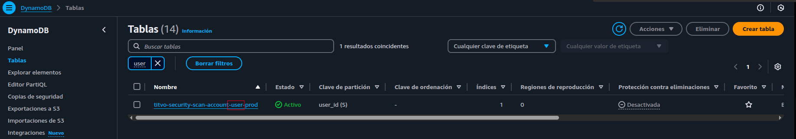
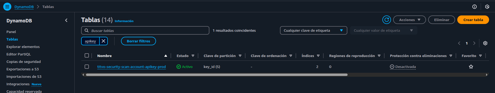
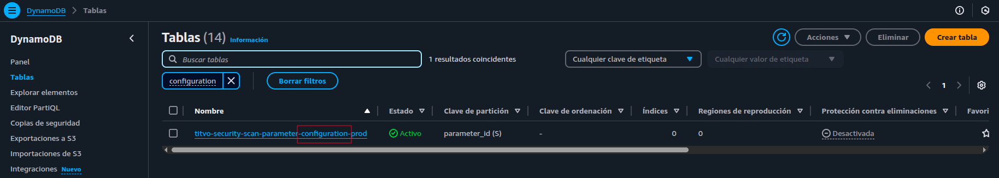
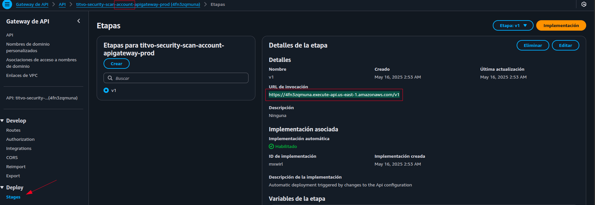

# Titvo Getting Started

Este proyecto proporciona una herramienta para configurar los recursos necesarios de Titvo en tu entorno AWS. Titvo es una solución de análisis de seguridad para repositorios de código que utiliza inteligencia artificial para detectar vulnerabilidades que no son fácilmente identificables por herramientas SAST (Static Application Security Testing) convencionales.

## Descripción

Este proyecto **no realiza el escaneo de código directamente**, sino que configura los recursos de AWS necesarios para que Titvo funcione correctamente, incluyendo:

- Creación de tablas en DynamoDB para usuarios y configuración
- Configuración de claves API y credenciales
- Almacenamiento de plantillas y configuraciones en AWS
- Generación de claves API para acceder al servicio Titvo

Una vez configurado, podrás utilizar Titvo a través de sus herramientas cliente para analizar repositorios y detectar:
- Código malicioso o backdoors
- Filtración de datos sensibles o credenciales
- Vulnerabilidades de seguridad
- Malas prácticas que puedan comprometer la seguridad

## Requisitos previos

- Node.js (versión recomendada: 18 o superior)
- pnpm (o npm/yarn)
- Cuenta de AWS con acceso a:
  - DynamoDB
  - Secrets Manager
  - Otros servicios necesarios según la configuración
- Una clave de API de OpenAI para los análisis basados en IA

## Instalación

1. Clona este repositorio:
   ```bash
   git clone https://github.com/titvo/titvo-getting-started.git
   cd titvo-getting-started
   ```

2. Instala las dependencias:
   ```bash
   pnpm install
   ```

## Configuración

Para configurar los recursos de Titvo en AWS, ejecuta:

```bash
pnpm start
```

El script te guiará a través de un proceso interactivo para proporcionar la siguiente información:

1. **Credenciales de AWS**:
   - AWS Access Key ID
   - AWS Secret Access Key
   - Región AWS (por defecto: us-east-1)

2. **Configuración de Titvo**:
   - Nombre de tabla DynamoDB para usuarios:
     Para obtener el nombre de la tabla, ve a la consola de AWS en la sección de DynamoDB y busca el nombre de la tabla filtrando por la paralba `user`.
     
   - Nombre de usuario Titvo
   - Nombre de tabla para claves API
     Para obtener el nombre de la tabla, ve a la consola de AWS en la sección de DynamoDB y busca el nombre de la tabla filtrando por la paralba `apikey`.
     
   - Nombre de tabla para configuración
     Para obtener el nombre de la tabla, ve a la consola de AWS en la sección de DynamoDB y busca el nombre de la tabla filtrando por la paralba `configuration`.
     
   - Nombre del secreto en AWS Secrets Manager
     Para obtener el nombre del secreto, ve a la consola de AWS en la sección de Secrets Manager y busca el nombre del secreto filtrando por la paralba `titvo`.
     
   - Modelo de OpenAI a utilizar
   - Nombre del bucket para archivos CLI
     Para obtener el nombre del bucket, ve a la consola de AWS en la sección de S3 y busca el nombre del bucket filtrando por la paralba `titvo`.
     
   - Clave API de OpenAI
   - Prompt del sistema para análisis de seguridad
   - Nombre de la cola de trabajos de escaneo
   - Plantilla HTML para reportes
   - Endpoint para tareas
   - Nombre del bucket para reportes
   - Dominio del bucket de reportes
   - Definición de trabajo para escaneo de seguridad

La configuración se guardará en un archivo `config.json` que será utilizado en futuras ejecuciones.

> [!NOTE]
> Si quieres cambiar la configuración, puedes hacerlo editando el archivo `config.json` directamente.

## Resultado

Una vez completada la configuración, el script:

1. Creará un usuario en la tabla de usuarios de Titvo
2. Generará una clave API y la almacenará de forma segura
3. Configurará todos los parámetros necesarios en AWS
4. Mostrará la clave API generada y el ID de usuario al finalizar

Esta información será necesaria para utilizar las herramientas cliente de Titvo que realizan el análisis de seguridad real.

## Probar configuración

Para probar que toda la configuración está correcta, puedes ejecutar la CLI de Titvo: `tli`.
`tli` puede ser descargado desde [aquí](https://github.com/titvo/titvo-cli/releases).

Una vez descargado, ejecuta el siguiente comando:

```bash
tli setup
```

Este comando te pedirá el endpoint de Setup,ID de usuario, la clave API que generaste en el paso anterior.

> [!NOTE]
> Si no tienes el endpoint de Setup, puedes obtenerlo desde la consola de AWS en la sección de API Gateway.
> 

## Estructura del proyecto

- `start.mjs`: Script principal para configurar los recursos de Titvo
- `lib/`: Directorio con módulos de la aplicación
  - `setup.mjs`: Funciones para configurar los recursos en AWS
  - `aws.mjs`: Utilidades para interactuar con servicios AWS
  - `crypto.mjs`: Funciones para operaciones criptográficas
  - `prompt.mjs`: Gestión de entradas de usuario para configuración
- `config.json`: Archivo de configuración generado durante la configuración
- `report_template.html`: Plantilla para los reportes de seguridad

## Licencia

Este proyecto está bajo la licencia ISC. Consulta el archivo LICENSE para más detalles. 